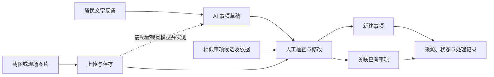

# OneCase 初赛材料清单与报名信息

更新：2026-09-05，StepFun 接入核验后。当前采用个人参赛版 v2，不使用团队名称。Markdown 讲稿、Demo 准备和邮件已更新；PPTX、备注、PDF 与项目简介 Word 尚未同步本轮 StepFun 表述，发送前需重新导出并核对。v1 仅保留历史备份。

适用赛事：江岸计划·AI 黑客松创新大赛。
依据：用户提供的《初赛细则与注意事项》4 页，以及本仓库 PRD 和实现。
本文不是已提交记录，未发送邮件。当前材料入口见 [提交说明](README.md)，不要从历史目录取附件。

## 1. 已确认与待补信息

| 字段               | 当前内容                                                                                                                                              |
| ------------------ | ----------------------------------------------------------------------------------------------------------------------------------------------------- |
| 项目名称           | OneCase                                                                                                                                               |
| 项目中文说明       | 社区事项 AI 工作台                                                                                                                                    |
| 参赛人数           | 1 人，个人参赛                                                                                                                                        |
| 团队名称           | 不使用团队名称；报名记录的匹配方式如有疑问向组委会确认                                                                                                |
| 已报名赛道         | AI+民生（2026-08-31 参赛者确认）                                                                                                                      |
| 姓名               | 乔瑞雪                                                                                                                                                |
| 学校／公司         | 【待补；如无单位，按实际身份填写】                                                                                                                    |
| 专业／职务、年级   | 【待补；不适用项按报名要求处理】                                                                                                                      |
| 联系方式           | 【待补；只填写在报名资料与邮件签名，不放入 PPT/PDF】                                                                                                  |
| 本项目承担         | 个人参赛、独立开发（2026-08-31 本人确认）                                                                                                             |
| 相关经历           | AI 工作流与 RAG、人机协作工具、数据保护及测试工程化；沿用此前整理的公开项目资料，见 [参赛者介绍](个人参赛版/05-参赛者介绍.md)，本轮未重新查阅外部仓库 |
| 过往作品／案例     | [LOOM-PLUS](https://github.com/qrx-joe/LOOM-PLUS)、[ResetAgent](https://github.com/qrx-joe/ResetAgent)、[Note](https://github.com/qrx-joe/note)       |
| 是否已完成报名     | 【待确认；赛前物料不能代替报名】                                                                                                                      |
| 项目是否已公开发布 | 未公开发布（2026-08-31 本人确认；不另行推断赛事“发表”定义）                                                                                           |
| 项目是否已商业化   | 【尚未确认；未公开发布不自动等于未商业化】                                                                                                            |

本人已确认独立开发。第三方组件、AI 辅助及原创边界仍应如实说明；过往公开项目是个人经历证明，不是本次 OneCase 项目的发布记录。

## 2. 可直接使用的项目 brief

**一句话定位**

OneCase 面向社区工作人员，把居民反馈整理为可确认、可关联、可追踪的社区事项。

**拟解决的痛点**

一条反馈可能包含多个问题，不同居民的反馈又可能指向同一事项。工作人员需要拆分、查重、重复录入，并在聊天和台账之间追踪处理进度。以上为本项目的问题假设，当前没有真实访谈或耗时测量证明其频率和规模。

**目标用户**

社区工作人员和网格员是直接使用者，社区负责人查看事项进展。居民是信息来源，当前不需要操作 OneCase；文字和图片由工作人员录入，尚未接入微信。

**项目摘要**

OneCase 帮社区工作人员把反馈整理成草稿，由人确认新建或关联事项，再跟进处理进度。文字流程已实现，图片支持上传、预览、保存和恢复，Qwen、OpenAI、StepFun 图片消息已接通。当前 StepFun 已用一条合成图片真实跑通至 Review，但代表性识别效果仍未验证；Mock 不能识别图片。语音暂未支持，实际提效仍待验证。

**概念图内容（示意，不是运行截图）**

## 3. 必交与选交材料

| 性质     | 材料                       | 当前状态                                                            |
| -------- | -------------------------- | ------------------------------------------------------------------- |
| 必交     | 展示 PPTX 1 份             | 已选 v2，共 14 页；现有正文和备注尚未同步 2026-09-05 StepFun 表述   |
| 必交     | 同一 PPT 导出的 PDF 1 份   | 现有文件为此前 v2 导出；14 页、16:9，需在 PPT 更新后重新导出并复核  |
| 自行补充 | 项目简介 Word 1 份         | 现有文件共 1 页、与 PDF 同目录；需核对 StepFun 表述；不是官方必交项 |
| 应体现   | 参赛形式、赛道、项目 brief | 个人参赛、AI+民生；姓名和电话放报名资料及邮件，不加回展示页         |
| 加分项   | 过往案例／作品集链接       | 沿用此前核对的公开项目资料，不作为 OneCase 已有客户或使用效果的证明 |
| 建议项   | 约 100 字项目摘要          | 本文已提供                                                          |
| 建议项   | 1 张概念图                 | 本文已提供 Mermaid 图稿；可在 PPT 中制作                            |
| 条件要求 | 开源组件 License 标注      | 技术文案已列出主要组件；完整清单待核对                              |

细则没有要求单独提交源代码压缩包、Demo 视频、身份证扫描件、商业计划书 Word 或原创承诺书。不要把准备建议写成官方必交项。

## 4. 提交规范

- 截止：2026 年 9 月 1 日前。原文没有给出当天具体时刻，稳妥做法是 8 月 31 日完成发送；不要自行延长至 9 月 1 日 23:59。
- 收件人：FLOWARYOPC@163.com。
- 附件：PPTX、PDF 各 1 份，一并提交。
- PPT：16:9；主体不超过 15 页，封面与 Q&A 不计入；禁止拉伸。
- PPT 文件名：`赛道-团队名-项目简称-v1.pptx`。
- 已选个人参赛版 v2，文件名为 `AI+民生-个人参赛-OneCase-v2.pptx` 及同名 PDF，与补充简介集中在 [初赛提交附件-v2](初赛提交附件-v2/)。此替代命名不是主办方已认可的结论，如需对应报名记录，应向组委会确认。
- PDF 文件名：细则未单列命名规则，建议同名并改为 `.pdf`。
- 逾期后果：原文规定视为自动弃权。
- 路演：12 分钟展示、5 分钟问答。单人参赛由本人完成；自备笔记本。

## 5. 邮件草稿（尚未发送）

使用 [个人参赛版提交邮件](个人参赛版/04-提交邮件.md)，主题为“初赛材料提交｜AI+民生｜OneCase”。邮件正文已更新，v2 PPT/PDF 和项目简介仍需同步后才能称为功能说明一致；邮件列出三份附件。填写电话并核实报名及资格后再发送，不要复制历史草稿中的团队名称或联系方式放置建议。

## 6. 发送前核对

- [ ] 核实已完成报名，赛道与个人身份能匹配报名记录，不使用旧团队名称。
- [ ] 在报名资料和邮件中补齐必要个人信息，删除电话占位符；展示页不写姓名、电话、学校或单位。
- [ ] 核实“原创、未发表／未商业化”的资格要求；如已公开或商业化，取得主办方对适用口径的答复。
- [ ] 明确客户、合作、用户数、收入及提效数据的证据；没有证据就不写。
- [ ] 标明主要开源组件 License，按实际依赖补全。
- [ ] 明确演示的模型模式及合成数据属性。
- [ ] 按 2026-09-05 新版讲稿更新 v2 PPT 第 3、8、9、12 页及备注，重新导出 PDF 并核对 Word；明确 StepFun 单次合成图片链路证据、Mock 边界和仍未验收项。
- [x] v2 PPT 为 16:9，共 14 页（含封面与问答），包含项目、开发工作、工程证据、商业设想及技术说明。
- [x] 2026-08-31 曾从当时的最终 v2 PPT 导出 PDF，并核对两份文件的页数、文字和图像；本轮更新后仍需重新导出。
- [x] 2026-08-31 曾逐页检查 14 页 PDF，恢复原主题与中文字体并通过 PPT 结构检查；本轮新版本尚未完成同等检查。
- [ ] 在路演使用的 PowerPoint/WPS 中打开 PPT，检查显示及外链，并完成一次演示播放。
- [ ] 完成一次不超过 12 分钟的路演排练。
- [ ] 发出邮件并保存发送记录；争取取得收件确认。

已勾选项仅代表本次实际完成的材料制作与核验；未勾选的报名、资格、排练、目标演示软件检查和发送事项仍需完成。
