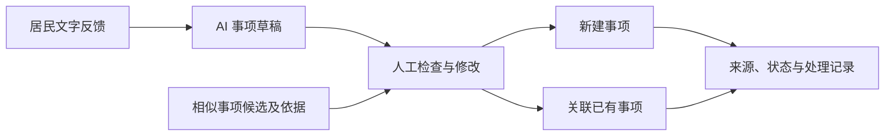

# OneCase 初赛材料清单与报名信息

更新：2026-08-31。状态：PPTX 与 PDF 已生成（`AI+民生-不理不器-OneCase-v1`），待个人信息复核后发送。

适用赛事：江岸计划·AI 黑客松创新大赛。
依据：用户提供的《初赛细则与注意事项》4 页，以及本仓库 PRD 和实现。
本文不是已提交记录；已有 v1 PPTX、PDF。后续个人经历补充已写入文案，尚未同步到这两份附件，也未发送邮件。

## 1. 已确认与待补信息

| 字段 | 当前内容 |
|---|---|
| 项目名称 | OneCase |
| 项目中文说明 | 社区事项 AI 工作台 |
| 团队人数 | 1 人，队长与成员为同一人 |
| 团队名 | 不理不器 |
| 已报名赛道 | AI+民生（2026-08-31 参赛者确认） |
| 姓名 | 乔瑞雪 |
| 学校／公司 | 【待补；如无单位，按实际身份填写】 |
| 专业／职务、年级 | 【待补；不适用项按报名要求处理】 |
| 联系方式 | 【待补；仅填写参赛所需联系方式】 |
| 本项目承担 | 个人参赛、独立开发（2026-08-31 本人确认） |
| 相关经历 | AI 工作流与 RAG、人机协作工具、数据保护及测试工程化；依据公开 GitHub 项目和本地作品集，详见《06-个人经历与团队介绍》 |
| 过往作品／案例 | [LOOM-PLUS](https://github.com/qrx-joe/LOOM-PLUS)、[ResetAgent](https://github.com/qrx-joe/ResetAgent)、[Note](https://github.com/qrx-joe/note) |
| 是否已完成报名 | 【待确认；赛前物料不能代替报名】 |
| 项目是否已公开发布 | 未公开发布（2026-08-31 本人确认；不另行推断赛事“发表”定义） |
| 项目是否已商业化 | 【尚未确认；未公开发布不自动等于未商业化】 |

本人已确认独立开发。第三方组件、AI 辅助及原创边界仍应如实说明；过往公开项目是个人经历证明，不是本次 OneCase 项目的发布记录。

## 2. 可直接使用的项目 brief

**一句话定位**

OneCase 面向社区工作人员，把居民文字反馈整理为可确认、可关联、可追踪的社区事项。

**拟解决的痛点**

一条反馈可能包含多个问题，不同居民的反馈又可能指向同一事项。工作人员需要拆分、查重、重复录入，并在聊天和台账之间追踪处理进度。以上为本项目的问题假设，当前没有真实访谈或耗时测量证明其频率和规模。

**目标用户**

社区工作人员和网格员是直接使用者，社区负责人查看事项进展。居民是信息来源，当前不需要操作 OneCase；文字由工作人员粘贴，尚未接入微信。

**约 100 字项目摘要**

OneCase 是面向社区工作人员的 AI 事项工作台。系统将居民文字反馈拆分为可编辑草稿，提示相似事项，由人确认新建或关联，再跟踪来源、状态与处理记录。当前聚焦文字链路，目标是减少重复整理与遗漏；实际提效仍待试点验证。

**概念图内容（示意，不是运行截图）**

## 3. 必交与选交材料

| 性质 | 材料 | 当前状态 |
|---|---|---|
| 必交 | 展示 PPTX 1 份 | 已生成两版任选：v1（程序排版）与 v2（ppt-master 编辑排版·editorial 风·含讲稿备注），均 16:9 共 14 页 |
| 必交 | 同一 PPT 导出的 PDF 1 份 | 两版 PDF 均已导出并核对一致 |
| 应体现 | 团队信息、赛道、项目 brief | 项目部分完成，个人及报名信息待补 |
| 加分项 | 过往案例／作品集链接 | 已核对三个公开 GitHub 项目，文案已补充，待同步正式附件 |
| 建议项 | 约 100 字项目摘要 | 本文已提供 |
| 建议项 | 1 张概念图 | 本文已提供 Mermaid 图稿；可在 PPT 中制作 |
| 条件要求 | 开源组件 License 标注 | 技术文案已列出主要组件；完整清单待核对 |

细则没有要求单独提交源代码压缩包、Demo 视频、身份证扫描件、商业计划书 Word 或原创承诺书。不要把准备建议写成官方必交项。

## 4. 提交规范

- 截止：2026 年 9 月 1 日前。原文没有给出当天具体时刻，稳妥做法是 8 月 31 日完成发送；不要自行延长至 9 月 1 日 23:59。
- 收件人：FLOWARYOPC@163.com。
- 附件：PPTX、PDF 各 1 份，一并提交。
- PPT：16:9；主体不超过 15 页，封面与 Q&A 不计入；禁止拉伸。
- PPT 文件名：`赛道-团队名-项目简称-v1.pptx`。
- PDF 文件名：细则未单列命名规则，建议同名并改为 `.pdf`。
- 逾期后果：原文规定视为自动弃权。
- 路演：12 分钟展示、5 分钟问答。单人参赛由本人完成；自备笔记本。

## 5. 邮件草稿（尚未发送）

收件人：FLOWARYOPC@163.com

主题：AI+民生-不理不器-OneCase｜初赛材料提交

组委会老师您好：

我是"不理不器"队长乔瑞雪，报名赛道为 AI+民生，本次以 1 人团队参赛。参赛项目为 OneCase 社区事项 AI 工作台。

附件为初赛展示 PPT 及对应 PDF 备份：

1. AI+民生-不理不器-OneCase-v1.pptx
2. AI+民生-不理不器-OneCase-v1.pdf

项目简介：OneCase 将居民文字反馈整理为事项草稿，由工作人员确认新建或关联，并跟踪来源、状态与处理记录。

请查收。如有材料缺项或格式问题，请联系我。

乔瑞雪
【联系方式】
【实际发送日期】

## 6. 发送前核对

- [ ] 核实已完成报名，赛道和团队名与报名一致。
- [ ] 补齐个人信息及本人实际贡献，删除全部待补占位符。
- [ ] 核实“原创、未发表／未商业化”的资格要求；如已公开或商业化，取得主办方对适用口径的答复。
- [ ] 明确客户、合作、用户数、收入及提效数据的证据；没有证据就不写。
- [ ] 标明主要开源组件 License，按实际依赖补全。
- [ ] 明确演示的模型模式及合成数据属性。
- [ ] PPT 满足 16:9、主体 ≤15 页，五个必含模块齐全。
- [ ] 从最终 PPT 导出 PDF，核对两份文件的页数、文字和图像。
- [ ] 本机打开两份附件检查乱码、截断、字体和链接。
- [ ] 完成一次不超过 12 分钟的路演排练。
- [ ] 发出邮件并保存发送记录；争取取得收件确认。

上述复选框均未代勾；本文准备完成不代表相关事项已完成。
